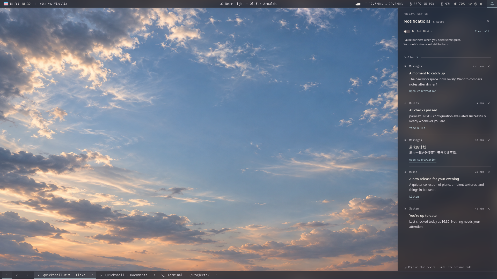

# 0001 — V1: the everyday shell

Status: selected design direction; implementation planned, not started.

Recorded: 2026-09-18.

Companion: [0002 — V2: Work in flight and herdr](0002-v2-work-in-flight.md).

## Intent and release boundary

Replace the existing two-bar Waybar setup with a small, coherent Quickshell desktop shell. The concept is **desk rails**: two continuous edges that organize the desktop, with temporary columns opening from them. It should feel like a room someone tends, not a control panel someone operates.

The emotional direction is a quiet workstation, soft technical precision, and a little personal strangeness. Typography, alignment, information hierarchy, and considerate behavior do most of the work. The sky and smoked glass supply atmosphere; individual widgets do not need their own decorative containers.

| Release | Commitment |
| --- | --- |
| V1, this document | Both bars, workspaces and titled window tasks, status and media, calendar, audio, battery/power/Keep awake, notification center, multi-output behavior, and Nix/session integration. |
| V2, document 0002 | Work in flight connected to herdr, using the V1 visual and popup infrastructure. |
| Explored, not selected | Return thread: notes attached to windows. Preserved in the prototype, but not an implementation requirement for either release. |

V1 must be useful and complete without herdr. This is not a one-for-one widget port, nor a broader replacement for the launcher, lock screen, compositor, or session manager.

## Archived design



This is a browser render at 1920 × 1080 logical pixels, with prototype controls and the V2/Return thread affordances hidden for the V1 projection. It is not a running Quickshell session.

- [Interactive HTML prototype](quickshell.prototype.html): copied unchanged from the working prototype. Open locally in a browser. Choose “Work in flight,” or the rightmost bell; the default also demonstrates the unselected Return thread exploration.
- [Work in flight render](prototype.png): the archived V2 exploration, including its illustrative job data.
- [Sky asset](quickshell.prototype-sky.png): local, generated preview wallpaper; provenance and prompt are recorded in the HTML comment.

All actions and data in the HTML are simulated and memory-only. Its preview toolbar, alternate layouts, sample jobs, and JavaScript are not production requirements. Preserve it as a design artifact, not a starting application architecture.

### Decisions already made

- Notification layout **C**: a right-side column opened from the rightmost top-bar control.
- Overall glass option **C**: **40% backing opacity** across both rails, notification column, popups, and notification banners. Text and icons remain fully opaque. This is a separate choice from notification layout C.
- A sky background and blurred, frosted surfaces. The later explicit request for glass supersedes the earlier preference against gratuitous transparency; it does not call for glossy cards or decorative blur everywhere.
- Power profile and idle inhibition move into the Battery popup. Keep awake gets a small bar indicator only while active.
- Dense but breathable information, global workspaces and individual titled window buttons on both outputs.
- Warm, practical microcopy and reversible local actions. [Piru](https://github.com/kageroumado/piru) informed the care for consequences, continuity, and the person using the interface; no Piru code or assets were copied. The inspected reference was commit `5f6a422`.

The implementation details below are proposed ways of delivering these choices, not claims that the HTML has already solved the live integration.

## Visual system

| Element | Starting specification |
| --- | --- |
| Silhouette | Full-width, flush top and bottom rails; 30 logical px each; each reserves its own space. No floating islands. |
| Material | Smoked charcoal backing, prototype tint `#20212b` at 0.40 alpha, restrained blur and a fine edge. One shared material definition. |
| Text | Warm primary `#e1dad3`, secondary `#b8b0b3`; quieter metadata only where it remains legible. Fira Code for bar/metrics, Noto Sans for longer reading and multilingual fallback. Start at 12 logical px for bar text. |
| Accent | Muted blue-grey `#a0bbc1` for selection; amber for attention and soft red for critical conditions. Most pixels remain neutral. |
| Rhythm | 4 px spacing unit; small groups use 8–12 px; panel reading edges about 20 px. Align icons and numerals to consistent text baselines. |
| Geometry | Mostly square edges, at most 2–4 px corner radius on secondary surfaces; 1 px separators. No pill around every datum. |
| Panels | Notification column about 384 logical px wide; ordinary popups about 340–400 px. Clamp to available output geometry and scroll content, not the entire panel. |
| Motion | Approximately 120–160 ms opacity/position settling, without bounce or glowing pulses. Respect reduced motion; no perpetual activity animation needed. |

These are logical sizes, not physical pixels on the 27-inch 4K display. Validate at the actual output scales before freezing typography. Active tasks use a narrow accent rule and a quiet tonal change; ambient metrics stay secondary. Hover and keyboard focus reveal interactivity without making the resting bar busy.

Use restrained personal details already present, such as the small flag and a quiet cat silhouette. Continuous decorative cat animation is not required. Full system version details belong in the identity popup, not permanently across the rail.

### Composition and limited space

```text
TOP    time · identity     |        media        | health · power · audio · tray | bell
                                      desktop
BOTTOM workspaces         | individual titled windows …                         |
```

The top has three layout zones. Media occupies a bounded center zone and truncates before colliding with status. The right cluster groups related readings with subtle separators: throughput; temperature/memory/pressure/failed units; battery; audio; tray; notifications. Healthy or absent optional signals do not create empty slots.

The bottom is a navigation rail: global workspaces first, then one button per window, including windows on other workspaces/outputs. Keep order stable when titles or focus change. Task widths adapt within a useful range (prototype: approximately 120–260 px), then overflow into a titled window list. Preserve workspace identity in that list. Do not silently drop windows or reserve a V2-shaped empty space in V1.

On narrower outputs, shorten identity/date/media first, then collapse secondary telemetry into its health entry. Preserve window access, workspace switching, battery/awake status, audio, and the bell. Test portrait and mixed-scale displays, not just the wide reference render.

## Behavior contract

### Rails and ordinary popups

- Clock opens a compact calendar; identity opens machine/system details. No agenda or account integration in V1.
- Media opens playback controls. Keep MPRIS player choice stable and handle a player disappearing. Retain the existing playerctld behavior where useful.
- Health opens network, memory, PSI, temperature when configured, and failed system/user service details. Retain a route to the existing full-screen `btop` view. Never turn a failed read into a plausible zero.
- Audio click opens volume/output controls, scroll adjusts by 1%, middle-click toggles mute, and right-click can retain the `pavucontrol` escape hatch. This deliberately changes the current primary-click mute behavior.
- Workspace click and scroll switch predictably without wraparound. Window click activates its workspace/window; middle-click requests close. Avoid optimistic removal before compositor confirmation.
- System tray items retain their native activation/menu behavior. Existing network/Bluetooth tray utilities remain usable; V1 does not need bespoke control panels for everything.
- One interactive popup or drawer is open across the shell at a time. It opens on the invoking output, closes on Escape or outside click, and restores focus appropriately. Bars do not take keyboard focus at rest. Repeating an active trigger closes its panel.
- On output removal, close or relocate the panel safely. Shared state does not reset when an output is added or removed. Notification banners appear once, on the focused output with a deterministic fallback.

### Battery and Keep awake

The Battery popup owns charge/time details, available power profiles, and Keep awake. On a desktop without a battery, expose the same controls through a compact Power entry rather than hiding idle inhibition. Show unavailable/degraded profile states honestly.

Keep awake offers 30 minutes, 1 hour, and explicitly “Until turned off”; default to a bounded hour. Display the remaining time in the popup and a small persistent indicator in the rail. Explain that it temporarily prevents automatic idle behavior, not that it disables all locking.

Attach the live inhibitor to a long-lived bar surface, not the popup: closing the popup must not end it. Use a deadline that is rechecked after suspend/resume and output changes. Cold shell restart resets inhibition off; do not silently persist “forever.” Verify actual compositor behavior before deciding whether one inhibitor or one per visible output is needed. Quickshell's [IdleInhibitor](https://quickshell.org/docs/v0.3.0/types/Quickshell.Wayland/IdleInhibitor/) is surface-associated, so fullscreen/visibility behavior is an implementation gate.

Preserve the current Swayidle sequence: lock at 300 seconds, DPMS off at 600, suspend-then-hibernate at 1800, and unconditional locking before sleep. Test Keep awake against that exact configuration; manual locking and before-sleep locking must remain effective.

### Notification center

The bell is the last control on the top rail. Unread count and critical attention are distinct from “how many entries are saved.” Merely opening the column is not a notification action; mark entries read when presented, without invoking their actions.

Use a single scrollable history column with compact app/time metadata, title, readable body, and explicit actions. Avoid nested cards. Ordinary completion can wait quietly; critical events get a restrained edge/color and remain accessible. The drawer overlays the desktop, reserves no extra workspace, and ends above the bottom rail.

V1 policy:

- Do Not Disturb suppresses ordinary banners, not history; critical notifications may bypass it. State that exception in the control's explanation.
- Keep a bounded, session-local history of 100 entries; transient notifications are not archived. No notification body or image persistence to disk.
- Respect replacement IDs, explicit client closure, supported timeout semantics, and action invocation. Separate banner visibility from history retention and client liveness.
- Dismiss and Clear all offer a brief Undo for local history. If a client has already been notified of closure, Undo cannot resurrect its live actions. Restore a historical record with inactive actions, not a misleading functional notification.
- Bound image/body sizes; render untrusted text safely. Advertise only notification capabilities actually implemented. No arbitrary command or remote resource execution from notification content.
- Hot reload and a cold restart are different: do not promise session history survives a process exit. Keep-on-reload behavior needs an explicit test.

Quickshell provides the [notification server](https://quickshell.org/docs/v0.3.0/types/Quickshell.Services.Notifications/NotificationServer/), but lifecycle and history policy remain our responsibility. Its [Notification API](https://quickshell.org/docs/v0.3.0/types/Quickshell.Services.Notifications/Notification/) distinguishes tracking, expiration, and dismissal; archive data separately from live objects.

Safety-critical compatibility: the existing Sway logout binding waits for a critical `notify-send --action=default="Log out" --wait` response. V1 must deliver the chosen action correctly and must not treat timeout/dismissal as confirmation. Test with a harmless stand-in command, never a real logout during automated validation.

## Implementation architecture

Build a small set of modules with real responsibilities. Visual components consume snapshots/models and explicit actions; they do not each discover devices, poll processes, or own protocol state.

| Module | Public surface | Complexity it owns |
| --- | --- | --- |
| Shell session / popup host | Current open panel and output; open/close; focus restoration | One-panel policy, geometry, hotplug, keyboard ownership and banner placement. |
| Desktop model | Workspaces, windows, focused IDs; activate/switch/close | Sway IPC identity, tree/event reconciliation, floating/Xwayland windows and workspace moves. |
| Notifications | History, unread/DND; dismiss/undo/invoke | D-Bus ownership, live versus archived lifecycle, replacement, timeouts, safe content. |
| Health | Metric snapshot and failure/availability flags | Shared sampling, counter resets, hwmon paths, PSI and failed-unit queries. |
| Power, audio, media, tray | Their native state and narrow user actions | Service disappearance, device/player identity and operation errors. Keep these separate where their lifecycles differ. |
| Per-output views | Render shared state and route interactions | Layout and presentation only; no duplicate polling or notification servers. |

Start with native Quickshell service modules for UPower/power profiles, PipeWire, MPRIS, and StatusNotifier items, checking the pinned package's actual APIs. Use explicit adapters only for real gaps such as Sway window enumeration and `/proc` health metrics. No generic plugin bus or speculative backend framework.

[Quickshell.I3](https://quickshell.org/docs/v0.3.0/types/Quickshell.I3/I3/) supplies workspace/compositor integration, but do not assume it supplies a complete window-task model. Plan a Sway tree/event adapter keyed by container ID, including title/focus/move/close events, floating windows, scratchpad policy, and reconnect reconciliation. Keep commands structured and never interpolate window titles into shell code.

Proposed source placement:

```text
modules/apps/quickshell.nix       feature, package/config generation, session wiring
modules/apps/quickshell/
  shell.qml                      shared models and per-screen instantiation
  Bar.qml                        top/bottom rail composition
  PopupHost.qml                  shared panel policy and placement
  Theme.qml                      tokens and common glass material
  desktop/                       Sway model and workspace/task views
  notifications/                 server/history and presentation
  status/                        health, power, audio, media and their popups
```

This is an ownership map, not a requirement to create empty scaffolding. Add components only when they hide meaningful complexity. Keep source assets next to the feature; expose declarative runtime values through generated configuration, including sensor paths and absolute executable paths. Preserve the established repository module pattern rather than introducing project-level enable options or new flake inputs.

### Glass is compositor work

The repository already uses SwayFX and enables blur. Real layer surfaces need explicit, stable Quickshell namespaces and corresponding SwayFX layer effects. [PanelWindow](https://quickshell.org/docs/v0.3.0/types/Quickshell/PanelWindow/) provides anchored exclusive rails; [WlrLayershell](https://quickshell.org/docs/v0.3.0/types/Quickshell.Wayland/WlrLayershell/) provides namespace and focus settings. Configure namespaces before mapping the windows.

Use the compositor's [layer effects](https://github.com/WillPower3309/swayfx#layer-shell-effects) for live blur. Verify both bars and popup/notification surfaces; do not assume a Qt popup gets the same treatment automatically. If necessary, use a dedicated layer surface for a drawer instead of a popup type that cannot obtain the required material/focus behavior.

The HTML contains a viewport-aligned blurred wallpaper fallback because the headless renderer did not paint `backdrop-filter`. That is a screenshot workaround, **not** a live-shell technique. Do not duplicate the wallpaper behind panels: real windows must blur correctly too. Keep the chosen 40% backing, calibrate blur/contrast on bright sky and busy application backgrounds, and offer an opaque/reduced-transparency fallback. Do not apply opacity to the whole window, including text.

## Migration from the current configuration

The baseline is [waybar.nix](../../modules/apps/waybar.nix), with session and notification ownership in [sway.nix](../../modules/apps/sway.nix).

| Touchpoint | Planned change / invariant |
| --- | --- |
| `modules/apps/quickshell.nix` | Export the native NixOS/Home Manager feature modules; use packaged Quickshell and generated configuration. Home Manager exposes `programs.quickshell` configuration and systemd integration; verify the pinned version's exact options before implementation. |
| `modules/apps/waybar.nix` | Retire after cutover validation, retaining an explicit rollback path meanwhile. Move the `hardware.sensors.cpuTemperature` declaration to the replacement feature without changing its path or duplicating declarations. Keep machine sensor values where they are. |
| `modules/apps/sway.nix` | Add layer effects; transfer service conditions to Quickshell; remove Mako ownership only at notification-server cutover. Keep SwayFX, UWSM, `bars = []`, lock/idle policy, launcher, and unrelated utilities. |
| `modules/roles/workstation.nix` | Replace the Waybar aspect with Quickshell. Do not change unrelated roles or the base-role invariant. |
| `modules/machines/stylix-test.nix` | Replace its direct Waybar import too. This is an important V1-without-herdr test machine. |

Do not simultaneously compose two features declaring the same sensor option. During development, run standalone fixture views rather than importing both full features. Transfer the declaration and all feature imports together at the cutover checkpoint.

Retain systemd service conditions for `WAYLAND_DISPLAY` and `XDG_SESSION_DESKTOP=sway`. Sway is UWSM-managed and its Home Manager `systemd.enable` is currently false; inspect the generated Quickshell unit and use the existing graphical-session lifecycle rather than assuming `sway-session.target` owns it. Stop cleanly on session exit and bound restart behavior after repeated failures.

There must be exactly one owner of `org.freedesktop.Notifications`: Mako before cutover, Quickshell afterward. A preview must not compete with the live daemon. Likewise, two exclusive bar pairs must not reserve desktop space at once.

Preserve useful behavior that is easy to miss in the visual mockup:

- Failed system **and** user unit count, hidden when healthy.
- Memory PSI `some avg60`, hidden at zero, warning at 5% and critical at 20%; details include `some`/`full` 10/60/300 values, swap and zswap.
- Optional configured CPU sensor, 3-second shared telemetry sampling as a starting point, counter-reset and unavailable states.
- Full NixOS version in details, all-output task/workspace access, native tray menus, audio and media behavior.

Backlight, CPU, and Bluetooth definitions that were not mounted in the old bar are not automatic parity obligations. A redesign may relocate details, but it must not quietly discard health warnings.

## Ordered implementation plan

1. **Compatibility and fixture shell.** Confirm the repository's packaged Quickshell version against the 0.3.0 API baseline used here. Inspect Home Manager's pinned integration. Create fixture-driven QML views with no production notification ownership or compositor mutations. Evaluate the planned module composition, including sensor-option ownership.
2. **Rails and material.** Implement per-output geometry, exclusive zones, typography/tokens, real SwayFX blur and the single popup host. Validate sky and working-window backgrounds, scales, hotplug, keyboard focus, reduced motion and opaque fallback before adding all content.
3. **Navigation and everyday status.** Implement and test the shared desktop model, task overflow, calendar/identity, media, tray and health. Verify current warning thresholds and missing-device behavior.
4. **Power and audio.** Add Battery/Power with profile availability and Keep awake deadlines; verify lock/DPMS/sleep interactions. Add audio controls and error feedback without pretending an unsuccessful change took effect.
5. **Notifications.** Test the server in an isolated session first, including actions, replacement, DND, expiry, local Undo, bounded history and client closure. Reproduce the logout notification using a safe test action.
6. **Nix cutover and acceptance.** Switch imports and session ownership atomically; remove competing Waybar/Mako startup. Format changed Nix, stage new source files, evaluate affected configurations and run applicable flake checks. Inspect/build generated artifacts before any user-authorized activation.

Each checkpoint should leave a testable result. Do not wait until a full shell exists to discover that popup blur, notification actions, or idle inhibition do not work.

### Release gate and rollback

- Exercise two outputs, output unplug/replug, fractional scaling, portrait geometry, many windows, long/CJK titles, fullscreen, scratchpad and compositor reconnect.
- Verify only one poller per metric and one notification server regardless of output count. Measure idle CPU, wakeups, and memory against the current Waybar/Mako baseline under the same conditions; investigate sustained regressions rather than inventing a target from the HTML.
- Validate malicious/oversized notification input, stale actions, transient/replaced/critical notifications, clear/Undo, DND and process restart.
- Verify Keep awake survives popup closure, expires correctly after resume, and does not bypass explicit lock/before-sleep protection.
- Keep pure model/lifecycle tests separate from QML interaction tests and a real SwayFX integration checklist. Nix validation must preserve `nixos-configurations-import-base`; no blanket dependency update is part of this work.
- Test first in the existing VM/test configuration where practical, then on a real output with explicit activation approval. A VM may not establish final blur/performance quality.
- Rollback restores the previous Waybar aspect, its sensor-option owner and service conditions, and Mako as the sole notification daemon, or uses the previous working NixOS generation. Keep that complete path available until normal daily use is verified. Do not deploy or alter the running session merely to prepare these plans.

V1 is done when the everyday desktop works independently of herdr, the chosen visual system survives real application backgrounds and output changes, and notification/power behavior is safe. V2 must extend that foundation without becoming a prerequisite for it.
