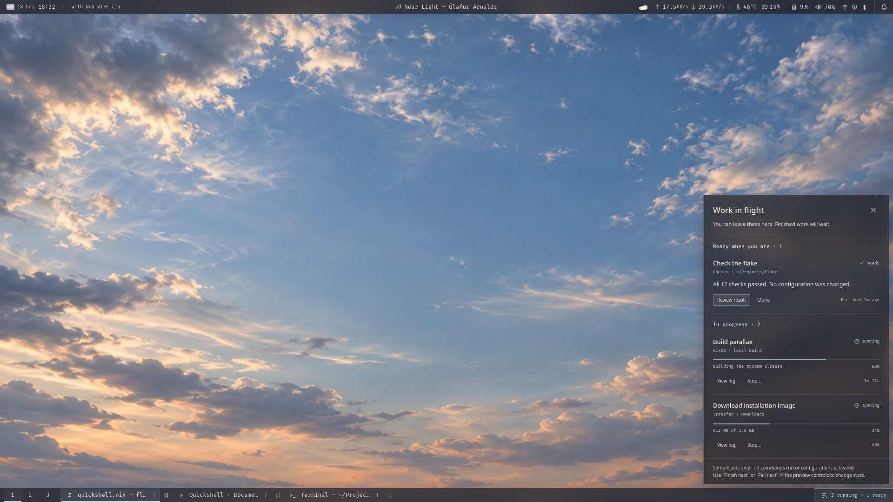

# 0002 — V2: Work in flight and herdr

Status: selected feature and integration direction; implementation planned, not started.

Recorded: 2026-09-18.

Prerequisite: [0001 — V1: the everyday shell](0001-v1-core-shell.md).

## Intent

Give ongoing agent work a quiet place in the desktop: visible enough to return to, unobtrusive enough to leave alone. **Work in flight** is a compact summary at the right of the bottom rail, opening a column of work that is running, needs the user's input, or is ready to revisit.

The user's selected direction is to connect this to **herdr**. Herdr remains the authority for sessions, agents, and their detected state; Quickshell becomes a small, caring view onto that work. It does not become another agent orchestrator.

“You can leave these here. Finished work will wait.” is the design attitude. Actual state labels must remain more precise: an agent reporting `done` means ready to review, not proof that its task or checks succeeded.

## Archived exploration



[Open the interactive prototype](quickshell.prototype.html) and choose “Work in flight”; the URL query `?preview=work&glass=C` also selects this view. [V1's document](0001-v1-core-shell.md#archived-design) describes the shared assets and material.

The image is a rendered HTML exploration at 1920 × 1080 logical pixels, not live herdr data. Prototype controls were hidden for the capture. The build/download/check rows, percentages, Stop and Retry actions are illustrative interaction samples. They are **not** an assertion that herdr supplies progress, build results, safe cancellation, or restart operations. Return thread bookmark controls remain visible in this archived exploration; that feature is not selected for V2.

Carry forward the panel's feeling, grouping, restraint, and persistence of ready work. Replace its invented job semantics with the verified herdr model below.

## Scope

V2 adds:

- A shared herdr connection and normalized activity model.
- A bottom-right summary such as `2 working · 1 ready`; `1 needs you` gets restrained attention when applicable.
- A frosted panel using V1's material, popup policy, keyboard behavior, output placement and reduced-motion treatment.
- Explicit navigation back to the relevant agent; optional bounded recent-output inspection initiated by the user.
- Honest unavailable/stale states, local dismissal of ready records, and reconciliation after reconnect.

V2 initially does **not** add generic process tracking, download/build hooks, automatic agent creation, prompt submission, approval of agent permissions, terminal input injection, Stop/Retry, cross-host discovery, a new notification daemon, or persistent transcript storage. Return thread remains outside the selected release.

## Interaction design

Keep the bottom rail primarily for windows. Work in flight is one compact end section, not one widget per agent. Counts update without making task buttons continually reflow: reserve a modest summary width while visible and use a compact form on narrow outputs. With no relevant work and no retained ready records, remove the section; do not keep an empty dashboard on the desktop.

The panel starts around 400 logical px wide, aligns with the triggering bottom-right section, and grows upward within the output. It is a list with separators, not stacked rounded cards. Use the same 40% backing opacity as V1; text remains opaque.

| Group | Meaning and presentation |
| --- | --- |
| Needs you | Herdr reports blocked. Explain that input may be needed; do not invent the question or label it a failure. Small amber emphasis, explicit Open agent action. |
| Ready when you are | Herdr reports done. Keep a reviewable record until acknowledged; no claim of successful tests or deployment. Quiet blue-grey emphasis. |
| In progress | Herdr reports working. Show agent/project identity and trustworthy context, not a fabricated percentage or animated activity spectacle. |

Order groups by attention, then keep item order stable within them. Idle/unknown agents do not count as working or ready. An optional compact “Other agents” disclosure can make them inspectable without filling the primary panel.

Each row should answer: which agent, in which project/workspace, what herdr currently knows, and where to return. Prefer a meaningful user-provided name/title; fall back to agent type plus workspace. Treat state labels as supplementary text, not a second source of truth. Use a compact path and relative last-change time only when their meaning is known. A locally observed timestamp must not masquerade as the true job start time.

Actions:

- **Open agent** explicitly focuses the target in herdr and raises its owning desktop window only when that mapping is reliable. Opening the panel never changes the user's active workspace.
- **Recent output**, if implemented, fetches a bounded text snapshot on demand. It is not a live transcript stream and is not automatically copied into notifications or logs.
- **Dismiss** acknowledges the local ready record, with Undo. It does not close a pane, stop an agent, change its herdr state, or mark its work successful.
- For a target that no longer exists, preserve enough local context to explain “This session has ended” and disable navigation. Closure is not inferred as successful completion.

Readiness records persist locally until dismissal within a bounded session history, even if viewing the agent later makes herdr report idle. Dismissing one must not dismiss later work from the same agent. Retain at most 100 historical records in memory; explain any history cap rather than promising indefinite storage. No disk persistence in initial V2.

Loss of connection changes the source to “Disconnected — last seen …”, not “Failed.” If retained records exist, keep them visibly stale; if herdr has never been configured or available, V1 stays quiet without an error badge. Opening/reconnecting to the panel does not trigger a burst of completion notifications.

## Verified integration baseline

Repository and local inspection on 2026-09-18 found:

- [herdr.nix](../../modules/apps/herdr.nix) already manages the package, TOML configuration, and declared plugin links.
- [agents.nix](../../modules/apps/agents.nix) composes herdr, enables the existing reviewr integration, and selects system toast delivery. Keep that workflow intact.
- [wayherdr.nix](../../modules/packages/wayherdr.nix) packages a Waybar-oriented summary tool, but the current Waybar module does not mount it. Its existence does not require using formatted Waybar output as the new data model.
- The installed CLI reported **herdr 0.9.1**. Its bundled `herdr api schema --json` reported **protocol 22**, schema version 1. These are observed compatibility facts, not permission to pin or update dependencies in this change.

The bundled schema was inspected without reading live agent contents or contacting an active session. Recheck the package selected by the repository at implementation time; an installed binary and the evaluated flake package may differ.

Herdr's [socket API](https://herdr.dev/docs/socket-api/) is a local Unix-socket, newline-delimited JSON protocol with request IDs and event subscriptions. Prefer that structured source for a long-lived integration. Its [agent model](https://herdr.dev/docs/agents/) owns state detection; Quickshell must not independently infer status from terminal prose or window-title changes.

Observed API surface relevant here:

- `session.snapshot`, `agent.list`, `agent.get` for state and reconciliation.
- `events.subscribe` for changes; subscriptions include pane/workspace lifecycle events and per-pane `pane.agent_status_changed`.
- `agent.focus` for an explicit user navigation request.
- `agent.read` / pane output APIs for a separately validated, bounded read action.

The inspected schema does **not** expose a semantic `agent.cancel` or `agent.retry`, nor an agent progress percentage or generic failed status. Do not substitute `server.stop`, pane closure, or injected Ctrl-C for a safe cancellation contract.

## State model

Keep source state, connection freshness, and local acknowledgement separate. A lost socket is not an agent failure; an acknowledgement is not an agent state transition.

| Herdr `AgentStatus` | Shell interpretation | Avoid |
| --- | --- | --- |
| `working` | Working; counted in progress | Fake percentages, predicted remaining time, inferred task success. |
| `blocked` | Needs you; counted separately | Calling every blocked state an error or automatically approving anything. |
| `done` | Ready to review; capture a local readiness record | “All checks passed” without a separate trustworthy result source. |
| `idle` | Idle; available through optional detail | Treating idle as done or failed. |
| `unknown` | State unavailable | Guessing state from agent title or decorative labels. |

Suggested normalized record:

```text
Activity
  identity: endpoint/session identity + terminal identity + agent-session identity when present
  target: current workspace/tab/pane identifiers for routing
  sourceState: working | blocked | done | idle | unknown
  freshness: current | stale | unavailable
  display: agent, title, workspace, project path, safe supplementary labels
  sourceRevision, sourceStateChangeSeq, connectionEpoch
  observedAt, lastStateChangeObservedAt
  localReadinessRecord, localAcknowledgement
```

`AgentInfo` contains `terminal_id`, workspace/tab/pane IDs, `revision`, and `state_change_seq`; `agent_session` is optional. Pane IDs alone are insufficient identity across sessions/restarts. Treat an absent or changed agent-session identity conservatively: never bind a retained record to a replacement agent merely because its title or pane slot matches.

Resource revisions and state-change sequences are not a global event clock. Namespace them by source/resource and reset assumptions when the source session is replaced. Use a local connection epoch to discard responses from old connections. A retained ready record needs its own state-transition identity so unrelated title/metadata revisions do not make it reappear after dismissal. A later working → done transition must create a new record.

The inspected status event carries state and identifiers but no universal sequence/revision. Treat events as invalidations, then fetch authoritative agent/snapshot data. Do not overwrite versioned records just because an unversioned event arrived last. If a transition is missed during a disconnect, show the reconciled state without inventing its duration or outcome.

## Implementation seams

| Module | Small public interface | Hidden responsibility |
| --- | --- | --- |
| WorkInFlight model | Items/groups/counts, source health; open/read/dismiss/undo | Presentation state, readiness retention, acknowledgement, freshness and stable ordering. |
| Herdr adapter | Snapshot/change stream and explicit focus/read operations | Socket lifecycle, framing, request correlation, subscriptions, schema compatibility, identity and reconciliation. |
| Fixture adapter | The same data/action boundary, deterministic simulated responses | Offline UI work and tests for blocked/done/disconnect/restart cases without touching real agents. |
| Work panel and rail entry | Render models; invoke the above actions | Layout, keyboard access and interaction feedback only. |

Use an adapter because there is a real external protocol and a real test fixture, not to build a general backend framework. Reuse V1's single popup host; keep one shared herdr model for all outputs. No duplicate socket subscribers or state stores per bar.

Preferred source home is `modules/apps/quickshell/work/`, with integration values wired by `modules/apps/quickshell.nix` alongside the existing herdr configuration. V1's source may include the optional view without requiring herdr to be enabled. Do not make importing the core shell start herdr. Avoid a new flake input unless the pinned package demonstrably cannot satisfy the design.

First evaluate a direct Quickshell Unix-socket adapter. If protocol handling genuinely needs a helper for bounded framing, testing, or compatibility, make that a small feature-owned package under `modules/packages/`; decide from the spike, not by scaffolding a daemon prematurely. Never shell out to a poll loop for every row.

### Connection and reconciliation sequence

1. Resolve an explicitly configured local endpoint/session. Respect herdr's configuration/socket overrides; do not assume every graphical session should attach to one hard-coded default path. Initial rollout can support one endpoint, while namespacing identities correctly. Do not scan remote machines or auto-launch sessions.
2. Connect with request deadlines and bounded frame sizes; inspect protocol/version and supported operations. Unsupported protocol gets a recoverable source-unavailable state, not best-effort mutating calls.
3. Subscribe to pane/workspace lifecycle invalidations and obtain a snapshot. Establish the required per-pane status subscriptions, then reconcile again to close the snapshot/subscription race. Do not assume a global wildcard status subscription: the inspected `pane.agent_status_changed` subscription requires a `pane_id`.
4. Coalesce invalidations into targeted `agent.get` requests or a snapshot refresh. Update subscriptions when panes appear/disappear; match responses by ID. Handle split/multiple JSON lines, malformed input, closed targets and responses arriving out of order.
5. On connection loss, mark state stale immediately, bound retries with backoff, and reconnect with a fresh authoritative snapshot. A low-frequency shared reconciliation can cover missed events; it is not a substitute for correct subscription ownership.
6. On shell shutdown, close the subscriber without stopping the herdr session. On output hotplug, change only the views.

Verify exact request/event envelopes against the bundled schema: subscription names such as `pane.agent_status_changed` and delivered event kinds such as `pane_agent_status_changed` are not interchangeable strings.

### Navigation and privacy

`agent.focus` addresses herdr's pane selection; it does not by itself prove which Sway window should be raised. Establish a reliable relation to the owning terminal window using verified process/session metadata. Never focus a guessed window based on its display title. If that relation cannot be established, clearly say that focus changed inside herdr and provide a safe route to the terminal rather than silently moving the wrong workspace.

Keep the initial action allowlist narrow: read state, user-requested bounded recent output, and explicit focus. Use pane/terminal identity with a freshness check before acting. Surface disappearance or permission errors instead of silently retrying a command against a reused pane ID.

No automatic prompt capture, full transcript ingestion, secret-bearing API debug dumps, or transcript persistence. Render output as plain text, stripping terminal control sequences and bounding bytes/lines. Do not interpret agent output as shell commands, markup, or permission to act. Freeze fixture data in tests rather than recording real sessions.

The existing reviewr workflow stays in herdr. A future direct “Review” shortcut needs verified plugin capabilities and target semantics; the prototype's “Review result” label is not enough to invent that integration.

## Relationship to notifications

Herdr already delivers system toasts. V1 receives those through its notification server; V2 should not emit a second toast for every observed herdr transition. The rail and Work in flight panel provide durable in-session context while ordinary notifications retain their own lifecycle.

Do not deduplicate by guessing from notification titles. If tighter linking is later useful, require an explicit shared identifier/capability. DND affects banners; it must not erase Work in flight state or conceal that an agent needs input. The V2 panel and notification center obey the same one-open-panel rule.

## Ordered implementation plan

1. **Protocol and targeting spike.** Recheck installed/evaluated package versions and the bundled schema. In a disposable, explicitly created test session, verify snapshot identities, per-pane subscriptions, agent state transitions, restart behavior, focus semantics and bounded output reads. Do not experiment on the user's active agents.
2. **Fixture-backed model and view.** Implement the normalized states, compact counts, stable groups, readiness retention, dismiss/Undo and disconnected UI. Replace prototype job percentages with meaningful agent state. Verify the V1 shell remains complete with the feature absent.
3. **Read-only live adapter.** Implement framing, snapshots, dynamic subscriptions, reconciliation and reconnect. Exercise it against the disposable session. No focus, output capture or process-control side effects merely from opening the panel.
4. **Explicit return-to-work actions.** Add focus only after target identity/window mapping is validated. Add bounded recent output if it improves the workflow without duplicating the terminal. Keep Stop/Retry absent until a separate semantic contract is justified.
5. **Opt-in real-session trial.** Wire a chosen local endpoint, measure overhead and state quality during ordinary herdr use, and verify toast behavior. Ship with a reversible configuration change; disabling the connection must leave V1 intact and herdr running normally.

### Acceptance cases

- Working → blocked → working → done has correct labels/counts. Idle and unknown never produce false completion. Agent-detected states are shown as herdr's report, not proof of task success.
- A ready record stays until dismissed, even after a subsequent idle state. Metadata changes do not resurrect it; genuinely new completed work does. Undo restores only local acknowledgement.
- Source disconnect/restart, missed events, malformed/partial frames, stale replies, version mismatch and absent socket produce bounded resource use and honest availability.
- Pane closure/reuse, optional agent-session identity, identical titles and multiple endpoint namespaces cannot route an action to the wrong agent. Retry/focus after source replacement must revalidate identity.
- Adding/removing outputs does not duplicate subscriptions, counts, actions or notifications. Opening a panel never focuses an agent; only the explicit action does.
- Large output, ANSI escapes, markup-like text, CJK titles, missing project paths, many agents and long names remain safe and usable.
- No herdr session is started, stopped or modified by shell startup/shutdown. No prompts or permission responses are injected. No real transcripts are written to test fixtures or logs.
- System toast delivery remains unchanged and is not duplicated. DND does not suppress the activity model. V1 remains functional on a machine without herdr.

## Gates before broadening V2

The remaining engineering questions are concrete: reliable desktop-window targeting, state quality for each supported agent, identity across restored sessions, and the pinned protocol's subscription/lifecycle behavior. Resolve those in the spike rather than obscuring them with optimistic UI.

Generic build/download progress, safe cancellation/retry, durable cross-login history, remote sessions, and richer reviewr actions can follow if real use calls for them and their sources expose trustworthy contracts. They are not hidden prerequisites for delivering the selected Work in flight experience.
